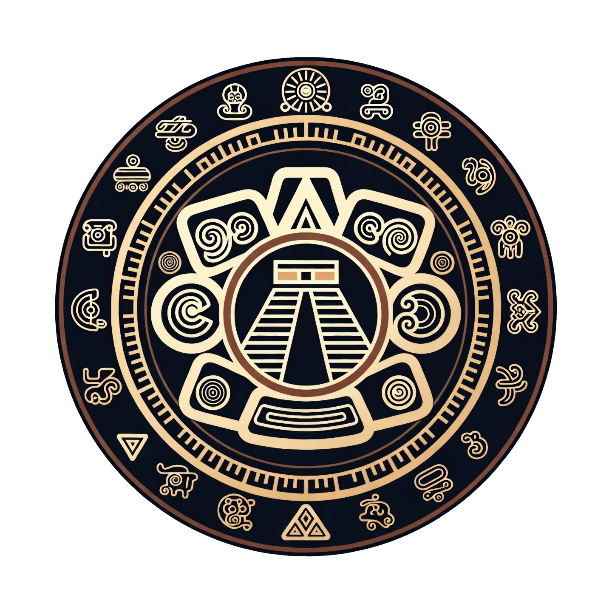

<div align="center">

<h1>Mayan Relationship MCP</h1>

MCP server that computes Mayan zodiac signs and generates relationship compatibility analyses. Deployed on Cloudflare Workers.

[Report Bug](https://github.com/mariodian/mayan-relationship-mcp/issues/new?template=bug-report.md) · [Request Feature](https://github.com/mariodian/mayan-relationship-mcp/issues/new?template=feature-request.md)

</div>

## ⚡ Quick Start

Add the remote MCP server to your AI assistant:

```json
{
  "mcpServers": {
    "mayan-relationship": {
      "url": "https://mayan-relationship-mcp.geckos-chillies-0y.workers.dev/mcp"
    }
  }
}
```

<details>
<summary><strong>OpenCode</strong></summary>

Add to your `opencode.json` or `opencode.jsonc`:

```json
{
  "mcpServers": {
    "mayan-relationship": {
      "type": "remote",
      "url": "https://mayan-relationship-mcp.geckos-chillies-0y.workers.dev/mcp"
    }
  }
}
```

</details>

<details>
<summary><strong>Claude</strong></summary>

Add to your MCP config file (`~/.claude/config.json` on Mac/Linux):

```json
{
  "mcpServers": {
    "mayan-relationship": {
      "type": "http",
      "url": "https://mayan-relationship-mcp.geckos-chillies-0y.workers.dev/mcp"
    }
  }
}
```

</details>

<details>
<summary><strong>Codex</strong></summary>

Add to your `~/.codex/config.toml`:

```toml
[mcp_servers.mayan-relationship]
url = "https://mayan-relationship-mcp.geckos-chillies-0y.workers.dev/mcp"
```

</details>

<details>
<summary><strong>Cursor</strong></summary>

Add to your `.cursor/mcp.json`:

```json
{
  "mcpServers": {
    "mayan-relationship": {
      "url": "https://mayan-relationship-mcp.geckos-chillies-0y.workers.dev/mcp"
    }
  }
}
```

</details>

Reload your assistant and try: _"Analyze the Mayan relationship compatibility between a male born on January 1, 1990 and a female born on May 15, 1992"_

## 📋 Table of Contents

- ⚡ [Quick Start](#-quick-start)
- 🤔 [Why Mayan Relationship MCP?](#-why-mayan-relationship-mcp)
- ✨ [Features](#-features)
- 🔧 [Tools](#-tools)
- 💡 [Example Prompts](#-example-prompts)
- 💬 [Contributing](#-contributing)
- 📜 [License](#-license)
- 📌 [Credits](#-credits)

## 🤔 Why Mayan Relationship MCP?

The Mayan zodiac offers a unique system of day signs, galactic tones, and trecana signs. This MCP server brings that knowledge directly into your AI assistant, enabling instant zodiac lookups and relationship compatibility readings without leaving your workflow.

## ✨ Features

- **Zodiac lookup**: compute Mayan day sign, galactic tone, and trecana sign from any birthday
- **Relationship analysis**: generate structured compatibility prompts for two people or groups
- **Multiple relationship contexts**: romantic, friendship, colleagues, family, business, classmates, or general
- **Flexible date parsing**: accepts "January 1, 1990", "1990-01-01", "01/01/1990", "19900101"
- **Dual transport**: local stdio for desktop clients, remote HTTP/SSE via Cloudflare Workers
- **Zero API keys**: no authentication required for the hosted remote server

## 🔧 Tools

### `get_mayan_sign`

Computes the Mayan zodiac profile for a single birthday.

- **Input:** `birthday` (string, e.g., `"January 1, 1990"`, `"1990-01-01"`, `"19900101"`)
- **Output:** JSON with day sign, galactic tone, and trecana sign

```json
{
  "tone": { "number": 13, "name": "Oxlajuj", "english": "Cosmic" },
  "daySign": {
    "index": 7,
    "yucatec": "Manik",
    "kiche": "Kej",
    "english": "Deer"
  },
  "trecena": {
    "index": 15,
    "yucatec": "Men",
    "kiche": "Tz'ikin",
    "english": "Eagle",
    "position": 13
  }
}
```

### `analyze_relationship`

Computes both Mayan signs and returns a complete analysis prompt for the LLM.

- **Input:**
  - `birthday1` (e.g., `"January 1, 1990"`)
  - `gender1` (`"male"` or `"female"`)
  - `birthday2` (e.g., `"May 15, 1992"`)
  - `gender2` (`"male"` or `"female"`)
  - `analysis_type` (optional, default: `"romantic"`) — one of: `"romantic"`, `"friendship"`, `"colleagues"`, `"family"`, `"business"`, `"classmates"`, `"general"`
- **Output:** Structured markdown prompt with both Mayan profiles ready for relationship analysis

### `analyze_group`

Computes all Mayan signs and returns a complete analysis prompt for group dynamics among 3–10 people.

- **Input:**
  - `people` — array of objects with `birthday` (string) and `gender` (`"male"` or `"female"`)
  - `analysis_type` (optional, default: `"family"`) — one of: `"romantic"`, `"friendship"`, `"colleagues"`, `"family"`, `"business"`, `"classmates"`, `"general"`
- **Output:** Structured markdown prompt listing all group members and their Mayan profiles

## 💡 Example Prompts

Here are some prompts you can try with your AI assistant:

### Zodiac Lookup

- "What is my Mayan sign if I was born on January 15, 1985?"
- "Get the Mayan zodiac profile for March 22, 1990"

### Relationship Analysis (Romantic)

- "Analyze the Mayan relationship compatibility between a male born on January 1, 1990 and a female born on May 15, 1992"
- "Give me a romantic compatibility reading for two people: male born 1985-03-22 and female born 1987-07-14"

### Relationship Analysis (Friendship)

- "Analyze the Mayan friendship compatibility between a male born on June 10, 1988 and a female born on September 3, 1990"
- "What's the friendship dynamic between these two Mayan signs? Male born 19900101 and female born 19920515"

### Relationship Analysis (Colleagues)

- "Analyze the workplace compatibility between two colleagues: male born on February 14, 1985 and female born on November 8, 1992"
- "How well would these two people work together as colleagues? Male born 1988-06-10 and female born 1990-09-03, colleagues analysis"

### Relationship Analysis (Family)

- "Analyze the family relationship compatibility between a male born on December 25, 1960 and a female born on April 18, 1965"
- "What's the family dynamic between these two? Male born 19601225 and female born 19650418, family analysis"

### Relationship Analysis (Business)

- "Analyze the business partnership compatibility between a male born on July 4, 1980 and a female born on October 31, 1985"
- "How compatible are these two as business partners? Male born 1980-07-04 and female born 1985-10-31, business analysis"

### Relationship Analysis (Classmates)

- "Analyze the learning compatibility between two classmates: male born on September 1, 2005 and female born on January 15, 2006"
- "How well would these two students work together? Male born 20050901 and female born 20060115, classmates analysis"

### Group Analysis (Family)

- "Analyze the family dynamics between these three people: male born 1960-03-15, female born 1962-07-22, and male born 1985-11-08"
- "What's the family compatibility for a group of four: male born 19550101, female born 19580515, male born 19800808, and female born 19821212"

### Group Analysis (Colleagues)

- "Analyze the team dynamics for these four colleagues: male born 1985-01-10, female born 1987-04-22, male born 1990-06-15, and female born 1992-09-30"
- "How well would this team work together? Group of three: male born 19900101, female born 19910515, male born 19920808, colleagues analysis"

### Group Analysis (Friends)

- "Analyze the friendship compatibility between these five friends: male born 1990-01-01, female born 1990-03-15, male born 1991-06-22, female born 1992-09-08, and male born 1993-12-14"
- "What's the group dynamic for these three friends? Female born 19880101, male born 19890515, female born 19900808, friendship analysis"

## 💬 Contributing

Contributions welcome. Please open an issue or pull request on [GitHub](https://github.com/mariodian/mayan-relationship-mcp).

## 📜 License

MIT. See [LICENSE](LICENSE).

## 📌 Credits

[Mayan Relationship MCP on GitHub](https://github.com/mariodian/mayan-relationship-mcp) · [Mario Dian on X](https://x.com/mariodian)

---

_To self-host, build from source, or contribute, see [DEVELOPMENT.md](DEVELOPMENT.md)._
